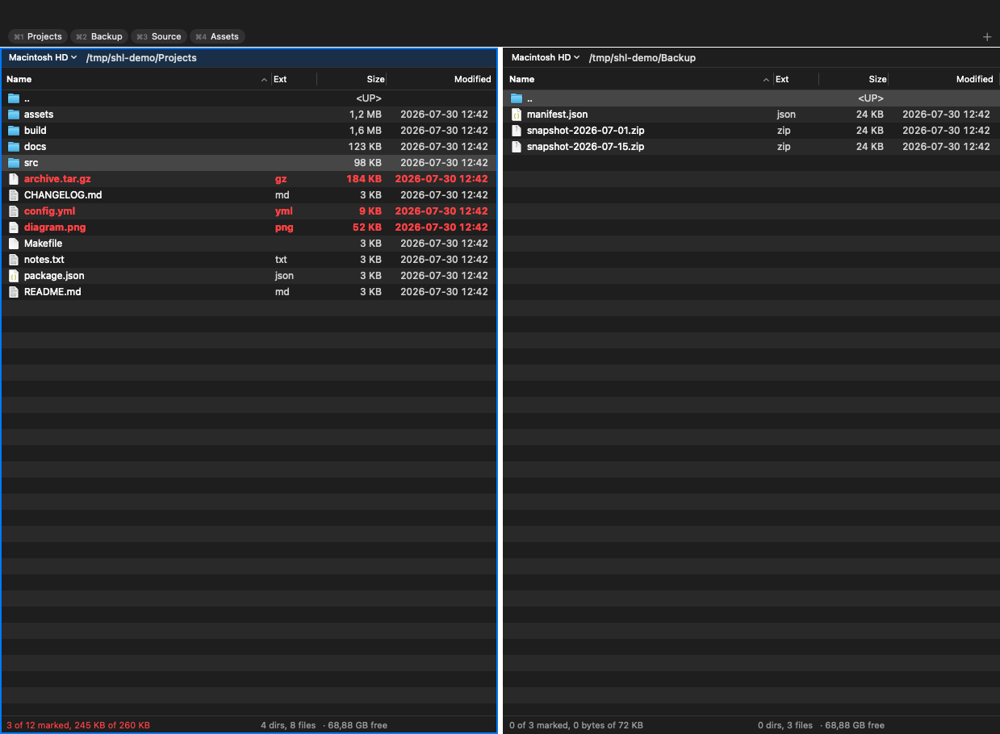

# shl-commander

A Total Commander–style dual-pane file manager for macOS. Native Swift, keyboard first.



Finder has no dual pane, no F-key command set, no bookmark hotkeys, no directory-size column,
and no keyboard-first selection model. This brings that working style to macOS: two panes, a
cursor that never wanders, marks kept separate from the cursor, and a command for everything.

## Features

- **Dual panes** with per-pane tabs, a draggable divider, and independent sort per tab.
- **Keyboard first.** Every command has a Total Commander binding and a ⌘ equivalent, all
  remappable. Typing any character starts a quick filter.
- **Marks separate from the cursor**, the way Total Commander does it: `Space` and `Insert`
  mark rows while the arrows move the cursor independently. Mark by shell glob with `Num +`.
- **Fast copies.** On one APFS volume, `clonefile(2)` copies a file or a whole tree instantly
  by sharing blocks; `rename(2)` moves one instantly. Only cross-volume work reads and writes
  bytes, and only then does progress mean anything.
- **Directory sizes on demand** (`⌃L`), cached against the folder's timestamp.
- **Favourite folders** on `⌘1`–`⌘9`, with a drag-to-reorder bar.
- **Live panes.** Each watches its own directory through FSEvents and reloads on change,
  keeping the cursor and the marks.
- **Session restore**: tabs, paths, sort, and focus come back on relaunch.
- Quick Look (`F3`), an internal text/hex viewer, Open in Terminal, Reveal in Finder.
- **A searchable shortcut list** (`F1` or `⌘/`), built from the live keymap, so it cannot fall
  out of step with what the keys actually do.
- **Browse inside archives.** `Return` on a `.zip`, `.tar.gz`, `.7z` and friends opens it like a
  folder: navigate down, filter, mark, preview with Quick Look, and copy files out. Folders
  inside an archive show their real recursive size straight away, since the archive already
  lists it.

## Requirements

macOS 26+, Xcode 26+, and [XcodeGen](https://github.com/yonaskolb/XcodeGen)
(`brew install xcodegen`). `ShlCommander.xcodeproj` is generated from `project.yml`, not
committed.

## Build

```bash
git clone https://github.com/vandershalan/shl-commander.git
cd shl-commander
make release   # builds, signs, installs to /Applications
```

Other targets:

```bash
make gen     # regenerate ShlCommander.xcodeproj from project.yml
make build   # xcodebuild, Debug
make test    # unit tests
make run     # build then launch the app
make icon    # redraw Resources/AppIcon.icns from Tools/make-icon.swift
```

## One-time macOS setup

### 1. Full Disk Access

The app is deliberately **not sandboxed** — a file manager that asks permission per folder is
unusable. macOS still gates `~/Desktop`, `~/Documents`, `~/Downloads`, `~/Library`, and other
users' home directories behind TCC, so grant access once:

**System Settings → Privacy & Security → Full Disk Access → +** and pick
`shl-commander.app`.

Everything outside those protected paths works without the grant.

> An ad-hoc signature (`--sign -`) changes on every rebuild, and TCC keys the grant to the
> signature. If the app stops reading `~/Documents` after a rebuild, remove and re-add it in
> Full Disk Access — or point daily use at the stable `/Applications` copy that `make release`
> installs.

### 2. Function keys

Total Commander's command set lives on F3–F8. macOS maps those to brightness and media unless
you turn on:

**System Settings → Keyboard → Keyboard Shortcuts → Function Keys →
"Use F1, F2, etc. keys as standard function keys."**

Every command also has a `⌘` equivalent, so the app is fully usable without changing that
setting. Holding `fn` works too.

## Keyboard reference

| Command | Total Commander | macOS |
| --- | --- | --- |
| Keyboard shortcuts | `F1` | `⌘/` |
| Quick Look | `F3` | `⌘Y` |
| View as text / hex | `⌥F3` | `⌘⇧Y` |
| Edit | `F4` | `⌘E` |
| New folder / new file | `F7` / `⇧F4` | `⌘⇧N` / `⌘⇧F` |
| Copy / move to other pane | `F5` / `F6` | `⌘C` / `⌘M` |
| Duplicate | `⇧F5` | `⌘D` |
| Rename in place | `⇧F6` | `⌘Return` |
| Move to Trash | `F8` | `⌘⌫` |
| Delete permanently | `⇧F8` | `⌘⇧⌫` |
| Measure selected / all folders | `⌃L` / `⌥⇧Return` | `⌘L` / `⌘⇧L` |
| New tab / close tab | `⌃T` / `⌃W` | `⌘T` / `⌘W` |
| Next / previous tab | `⌃Tab` / `⌃⇧Tab` | `⌘⇧]` / `⌘⇧[` |
| Open folder in other pane | `⌃↑` | |
| Favourites list | `⌃D` | `⌘B` |
| Add to favourites | | `⌘⇧D` |
| Jump to favourite 1–9 | | `⌘1`–`⌘9` |
| Switch pane | `Tab` | |
| Open | `Return`, keypad `Enter` | |
| Enclosing folder | `Backspace`, `⌃PageUp` | `⌘↑` |
| Volume root | `⌃\` | |
| Back / Forward | `⌥←` / `⌥→` | `⌘[` / `⌘]` |
| Refresh | `F2`, `⌃R` | `⌘R` |
| Sort by name / ext / date / size | `⌃F3` / `⌃F4` / `⌃F5` / `⌃F6` | `⌘⌥1`–`⌘⌥4` |
| Show hidden files | `⌃H` | `⌘⇧.` |
| Mark | `Space` | |
| Mark and advance | `Insert` | `⇧Space` |
| Mark / unmark by pattern | keypad `+` / keypad `-` | |
| Invert marks | keypad `*` | |
| Mark all / none | `⌃A` / `⌃⇧A` | `⌘A` / `⌘⇧A` |
| Send / take path across panes | `⌃⇧→` / `⌃⇧←` | |
| Swap panes | `⌃U` | |
| Open in Terminal | | `⌘⇧T` |
| Reveal in Finder | | `⌘⇧R` |
| Copy path | `⌃⇧Return` | `⌘⌥C` |
| Clear filter | `Esc` | |

The bar along the top of the window carries the favourites, a button that shows or hides
hidden files, and a button that opens the shortcut list. Sorting is also available by clicking
a column header.

Typing any printable character starts a quick filter, shown in a bar at the foot of the pane
with a live match count. `Backspace` edits that filter for as long as the bar is showing —
including once the text is empty — so clearing a filter never walks you out of the directory.
`Esc` closes the bar, and only then does `Backspace` mean "enclosing folder" again.

The cursor holds its place across every operation. When the row it sits on disappears, it
takes the nearest surviving row *above* where it was, walking past a whole deleted block if
need be.

Deleting always asks first, listing what is about to go: how many files and folders, their
total size, and the names themselves. Permanently deleting a folder, or more than ten items,
additionally requires typing the word `delete`.

`Return` on a file opens it in whichever app the system would use; `F4` opens it in your
editor, chosen in Settings.

### Archives

`Return` on an archive enters it, and from there everything works as it does in a folder:
arrows and `Return` navigate down, `Backspace` climbs back out — leaving the archive puts the
cursor back on the archive file — and filtering, marking, sorting, Quick Look and the internal
viewer all behave normally. Nested archives open in turn.

`F5` copies the selection out. It asks for a destination, extracts through a staging directory
inside it, and resolves name clashes with the same dialog a normal copy uses. Previewing or
opening a member extracts a scratch copy under the system temporary directory, which is removed
on quit.

**Archives are read-only.** Creating, renaming, moving and deleting inside one are refused with
a message rather than half-done, and edits to an opened member are not written back. Copy the
files out, change them, and repack.

Recognised: `zip` (including `jar`, `war`, `ipa`, `cbz`), `tar`, `tar.gz`/`tgz`,
`tar.bz2`/`tbz`, `tar.xz`/`txz`, `tar.zst`, `7z`, `rar`/`cbr`, `cpio`, `iso`, and the single
compressed streams `gz`, `bz2`, `xz`, `zst`, `Z`. A stream holds exactly one payload, so it opens
as a one-row listing you can preview and copy out decompressed.

The format is decided by the file's **content**, not its name, so an archive whose extension is
wrong still opens — a gzipped CSV handed out as `.zip` is a real and common case. When the two
disagree the archive marker in the path bar says so. The name is still what decides whether a row
offers `Return`, because sniffing every row of a large directory would mean opening every file
in it.

Reading is done by `/usr/bin/tar`, which on macOS is bsdtar over libarchive, and by `gzip` and
`bzip2` for streams — no third-party archive library is vendored. `xz` and `zstd` streams need
those tools installed (Homebrew); the app says which one is missing rather than failing
obscurely.

### Rebinding

**Settings → Keyboard** (`⌘,`) lists every command with its keys. Select one, press *Record
Shortcut*, and press the chord. A key already used elsewhere is taken from the other command,
since two commands on one key would make the winner arbitrary. Changes apply immediately and
are written to `keymap.json`; the menu-bar shortcuts catch up on the next launch, because
SwiftUI installs those once at startup.

To edit the file directly instead, create
`~/Library/Application Support/shl-commander/keymap.json` with only the differences — anything
you leave out keeps its default:

```json
{
  "_comment": "keys starting with _ are ignored",
  "swapPanes": ["cmd+shift+s"],
  "revealInFinder": []
}
```

An empty array unbinds a command. Command names are the `Command` cases in
`Sources/Keys/Command.swift`. Chords are `modifier+…+key`, where modifiers are `cmd`, `ctrl`,
`opt` (or `alt`), and `shift`, and keys are letters, digits, `f1`–`f12`, `space`, `return`,
`tab`, `backspace`, `escape`, `insert`, `home`, `end`, `pageup`, `pagedown`,
`up`/`down`/`left`/`right`, punctuation names such as `period` / `comma` / `backslash` /
`leftbracket`, and `keypadplus` / `keypadminus` / `keypadmultiply` / `keypadenter`. The keypad
keys are spelled out so that `+` is never both a separator and a key name.

A malformed entry is skipped rather than guessed at.

## Settings

`⌘,` opens Settings.

- **General** — restore the last session or always open at chosen folders, show hidden files
  by default, and pick the editor `F4` uses.
- **Keyboard** — the shortcut table described above.

## Where things are kept

`~/Library/Application Support/shl-commander/` holds `favorites.json`, `keymap.json`, and
`session.json`. Delete any of them to go back to defaults; the app writes the session on quit
and rereads it at launch.

## Layout

```
Sources/
  App/        SwiftUI app, window, menu bar, preferences, session
  Archive/    format detection, listing via bsdtar, index, extraction cache
  Core/       listing, sorting, icons, FSEvents, volumes, directory sizes
  Keys/       KeyChord, Keymap, KeyRouter, CommandDispatcher
  Ops/        copy/move engine, operation queue, conflict resolution, prompts
  Panel/      one pane: view model, NSTableView bridge, tabs, filter bar
  Favorites/  bookmark store and bar
  Preview/    Quick Look and the internal text/hex viewer
Tests/CoreTests/
Tools/make-icon.swift
```

The panels are `NSTableView` behind `NSViewRepresentable`, not SwiftUI `Table`: they have to
stay smooth at tens of thousands of rows, need exact arrow/Home/End/PageUp semantics, and need
a selection model independent of the cursor.

`Sources/App/RenderProbe.swift` is a development aid, compiled out of Release and inert unless
`SHL_PROBE_PNG` is set. It dumps the window as a PNG plus an indented view tree, which is the
only way to check layout from a terminal-driven build — Screen Recording permission cannot be
granted to one.

## Not implemented

Writing into archives (creating one, or adding to and deleting from an existing one), directory
synchronise, multi-rename tool, compare by content, branch view, and remote (SFTP) panels.

There is no CI workflow: GitHub's macOS runners do not yet ship an Xcode that can build a
macOS 26 target, so one would only ever be red. Run `make test` locally.

## License

MIT — see [LICENSE](LICENSE).
